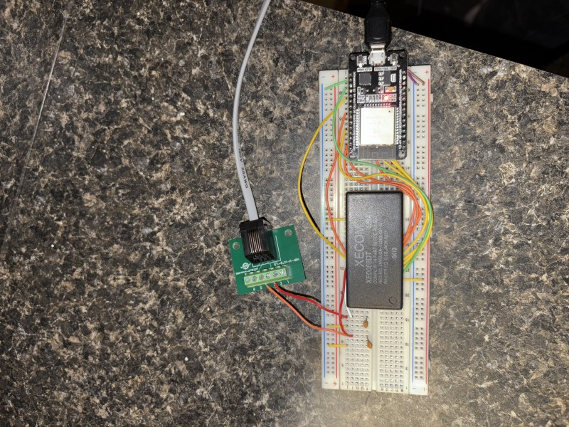

# Auto Door Unlocker - Never Get Locked Out Again!

## The Problem

You know that feeling when you're standing outside your apartment building at 2 AM, realizing you left your keys inside? Yeah, that was me. A lot. My building has one of those intercom systems where you can call up to your apartment and someone can buzz you in.

## The Solution

I built this automatic door unlocker that lets me in whenever I call my apartment number. Here's how it works:

1. When I call my apartment from the building's intercom
2. My ESP32-based system detects the ring
3. It automatically "picks up" the call
4. Sends the DTMF tone "9" (the unlock code)
5. Hangs up
6. Door unlocks!

All this happens in about 2 seconds. No more waiting outside!

## Demo Video

https://github.com/henryczup/auto-door-unlocker/raw/main/media/IMG_0.mp4

## Hardware Setup

### Components Used

- ESP32
- XE0068DT DTMF Module
- 2 470uF Capacitors
- Wires
- Bread Board
- RJ11 Cable
- RJ11 Breakout Adapter
- Micro USB
- 5v Power Supply

### Project Photos

_small.jpg>)

### Wiring

I connected the ESP32 to the XE0068DT module like this:

- Ring detection -> GPIO4
- Off-hook control -> GPIO5
- DTMF data lines -> GPIO12-15
- Control signals -> GPIO21-25

## How It Works

When someone calls your apartment from the building entrance:

1. The system detects the ring signal
2. Waits for 2 seconds (required billing delay)
3. Goes "off-hook" (picks up the call)
4. Sends the "9" tone to unlock the door
5. Hangs up automatically

## Future Improvements

I'm thinking about adding:

- WiFi control to enable/disable the auto-unlock
- SMS notification when someone calls
- Log of when the door was unlocked
